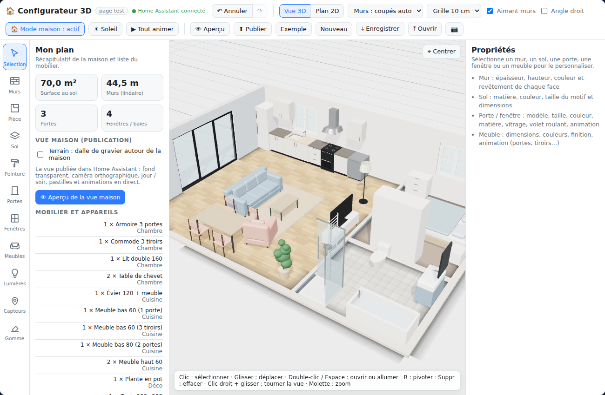

# Configurateur 3D pour Home Assistant

Dessinez votre maison en 3D (façon Sims / IKEA : murs, sols, portes, fenêtres, meubles, lumières), puis affichez-la dans un tableau de bord Home Assistant
où elle réagit en direct à vos entités : volets, portes et fenêtres qui s'ouvrent, lumières qui s'allument, capteurs, soleil réel ou simulé.



## Installation (HACS)

1. HACS → ⋮ → **Dépôts personnalisés** → collez l'adresse de ce dépôt, catégorie **Tableau de bord** (Dashboard) → Ajouter.
2. Installez **Configurateur 3D**, puis rechargez la page (Ctrl+F5). HACS enregistre la ressource tout seul.
3. Intégrez la carte dans un tableau de bord (section suivante).

## Intégrer le configurateur dans un tableau de bord

Le configurateur est une carte Home Assistant : `custom:configurateur-3d-card`. Le plus simple est de lui dédier une page entière.

1. **Paramètres → Tableaux de bord → Ajouter un tableau de bord → Nouveau tableau de bord vide**. Donnez-lui un titre (par exemple *Configurateur*).
2. Ouvrez ce tableau de bord, cliquez sur ✏️ (en haut à droite), puis sur ⋮ → **Éditeur de configuration brute**.
3. Remplacez tout le contenu par le code suivant, puis **Enregistrer** :

```yaml
views:
  - title: Configurateur
    path: configurateur
    type: panel
    cards:
      - type: custom:configurateur-3d-card
        height: calc(100vh - 56px)
```

4. Fermez l'éditeur et cliquez sur **Terminé**. Si la carte reste vide ou affiche « Custom element doesn't exist », faites Ctrl+F5.

Ce que fait ce code : `type: panel` donne toute la page à une seule carte, `custom:configurateur-3d-card` est la carte du configurateur,
et `height` règle sa hauteur (`calc(100vh - 56px)` = tout l'écran moins la barre du haut ; vous pouvez mettre une valeur fixe comme `700px`).

**Dans un tableau de bord existant** : ✏️ → **Ajouter une carte** → **Manuel**, puis collez seulement :

```yaml
type: custom:configurateur-3d-card
height: 700px
```

Le configurateur s'ouvre avec un petit appartement d'exemple (lumières et capteurs non reliés : cliquez sur un élément puis choisissez l'entité dans le panneau de droite).
Les plans sont enregistrés dans les données de votre utilisateur Home Assistant.

## Publier votre maison

Dans le configurateur, bouton **Publier** : le plan est copié dans une carte en lecture seule (`readonly: true`) d'un tableau de bord de votre choix, créé automatiquement.
La vue publiée a un fond transparent, une barre Auto / Jour / Soir / 3D libre, un panneau **Soleil** (heure, date, direct, orientation, boussole) et, pour les administrateurs,
un mode **⚙ Configurer** (ajouter, déplacer, supprimer capteurs et lumières, relier fenêtres, portes, volets et meubles animés à vos entités, enregistrer dans le tableau de bord).

## 🤖 Créer un plan à partir d'une photo ou d'un croquis (avec une IA)

Une IA peut transformer une photo, un croquis à la main ou un plan en fichier `plan.json`. Deux méthodes selon l'IA que tu utilises. Dans les deux cas : joins ta photo,
donne au moins une cote (sans échelle, l'IA devine les dimensions), puis enregistre le JSON reçu dans un fichier `plan.json` et ouvre-le dans le configurateur avec le bouton **Ouvrir**.
Les champs oubliés par l'IA sont complétés automatiquement et les éléments inconnus sont ignorés ; tu corriges ensuite à la souris.

### Méthode A — IA puissante (Claude, ChatGPT récent, Gemini Pro…) : un seul message

```text
Lis ce document : https://raw.githubusercontent.com/Karanktos/configurateur-3d-card/main/docs/IMPORT-IA.md
Puis, à partir de la photo jointe, fabrique le fichier plan.json pour le Configurateur 3D en suivant strictement ce document.
Réponds uniquement par le JSON complet, dans un seul bloc de code.
Cotes connues : (ex. le salon fait 5 m de long, la porte d'entrée 0,9 m)
```

Si l'IA ne sait pas ouvrir le lien, copie-lui le contenu de [`docs/IMPORT-IA.md`](docs/IMPORT-IA.md) à la place.

### Méthode B — IA gratuite ou petite IA : deux messages, plus simples

**Message 1** (avec la photo) : on décrit d'abord, sans JSON.

```text
Observe la photo jointe (plan ou croquis d'une maison). Décris-la en une liste simple, en mètres :
1. Les pièces : nom, largeur (est-ouest) × longueur (nord-sud). Le nord est en haut de l'image.
2. Les murs extérieurs : dimensions totales. Si aucune cote n'est écrite, prends une porte = 0,9 m comme échelle et dis-le.
3. Les portes et les fenêtres : dans quelle pièce, sur quel mur (nord, sud, est ou ouest), à quelle distance du coin nord-ouest de ce mur, largeur.
4. Les meubles principaux, avec leur pièce et leur position approximative.
Cotes connues : (ex. le salon fait 5 m de long)
Ne fais pas de JSON pour l'instant.
```

**Message 2** : corrige la description si besoin, puis envoie ceci (colle la description à la place de la dernière ligne).

```text
Convertis la description ci-dessous en JSON pour mon logiciel de plan 3D. Réponds uniquement par le JSON dans un seul bloc de code.
RÈGLES :
- Unités : mètres. x vers la droite (est), z vers le bas (sud). Origine (0,0) = coin nord-ouest de la maison.
- "walls" : un mur par segment, numérotés id 1, 2, 3… : {"id":1,"x1":0,"z1":0,"x2":10,"z2":0,"t":0.2,"h":2.5}. Murs extérieurs dans le sens horaire (nord vers l'est, est vers le sud, sud vers l'ouest, ouest vers le nord). Cloisons : t=0.1.
- "floors" : un rectangle par pièce : {"id":20,"x":0,"z":0,"w":5,"d":4,"mat":"parquet"} (x,z = coin nord-ouest, w = largeur est-ouest, d = profondeur nord-sud). mat : parquet, tile4, tile2, moquette, beton, pierre, marbre.
- "openings" : {"id":30,"kind":"door","model":"battant","wall":1,"s":2.0,"w":0.9} ; wall = id du mur, s = distance en mètres depuis le POINT DE DÉPART du mur jusqu'au CENTRE de l'ouverture (entre w/2 et longueur du mur - w/2).
  kind "door" : battant (0.9), vitree (0.9), double (1.4), coulissante (0.9), entree (0.95), passage (1.0, sans porte), sectionnelle (garage 2.8).
  kind "window" : fixe (1.0), battant1 (0.7), battant2 (1.2), coulissant (1.6), baie2 (2.0 de large, jusqu'au sol), baie3 (3.0), baie4 (4.25).
- "items" (meubles) : {"id":40,"model":"canape3","x":3,"z":2.5,"rot":0} ; x,z = CENTRE du meuble ; rot en degrés : 0 = face avant vers le sud, 90 = vers l'est, 180 = vers le nord, 270 = vers l'ouest (la face avant regarde vers l'intérieur de la pièce).
  model à choisir UNIQUEMENT dans cette liste :
  salon : canape2, canape3, canape_angle, fauteuil, tablebasse, meubletv, tv, biblio ; salle à manger : table, table_r, chaise, buffet ;
  chambre : lit90, lit140, lit160, chevet, commode, armoire2, armoire3 ; cuisine : kbas60, kbas80, ktiroirs, khaut, kevier, ilot ;
  électroménager : frigo, cuisiniere, four, lavelinge, lavevaisselle, hotte ; salle de bain : wc, vasque, baignoire, douche, miroir ; bureau : bureau, chaise_bureau ; déco : plante, tapis.
- Chaque id est un entier unique dans tout le fichier. Termine par "markers":[],"lights":[],"meta":{"rot":0,"v":2,"plot":true},"nid":100.
STRUCTURE : {"walls":[...],"floors":[...],"openings":[...],"items":[...],"markers":[],"lights":[],"meta":{"rot":0,"v":2,"plot":true},"nid":100}
EXEMPLE (pièce 6 × 4 m, une porte au sud, une fenêtre au nord, un canapé) :
{"walls":[{"id":1,"x1":0,"z1":0,"x2":6,"z2":0,"t":0.2,"h":2.5},{"id":2,"x1":6,"z1":0,"x2":6,"z2":4,"t":0.2,"h":2.5},{"id":3,"x1":6,"z1":4,"x2":0,"z2":4,"t":0.2,"h":2.5},{"id":4,"x1":0,"z1":4,"x2":0,"z2":0,"t":0.2,"h":2.5}],"floors":[{"id":5,"x":0,"z":0,"w":6,"d":4,"mat":"parquet"}],"openings":[{"id":6,"kind":"door","model":"battant","wall":3,"s":1.5,"w":0.9},{"id":7,"kind":"window","model":"battant2","wall":1,"s":3,"w":1.2}],"items":[{"id":8,"model":"canape3","x":3,"z":2.5,"rot":0}],"markers":[],"lights":[],"meta":{"rot":0,"v":2,"plot":true},"nid":100}
DESCRIPTION À CONVERTIR : (colle ici la réponse du message 1)
```

Si le résultat est faux (un mur manquant, une porte au mauvais endroit), demande à l'IA de corriger en précisant l'erreur, ou corrige à la souris dans le configurateur.
Un plan d'exemple complet est disponible : [`docs/exemple-plan.json`](docs/exemple-plan.json). Vérification facultative d'un fichier : `node tools/valider-plan.mjs plan.json`.

## Remarques

* three.js est chargé depuis jsDelivr (version épinglée) : un accès internet est nécessaire au navigateur.
* Au plus 8 lumières (6 sur téléphone) projettent des ombres en même temps (limite des unités de texture du GPU).
* Pas d'étage ni de toit ; les sols sont rectangulaires.

## Développement

```
npm i
npm run build      # produit dist/configurateur-3d-card.js (un seul fichier, ce que HACS installe)
```

Code dans `js/` (état et scène `core.js`, outils `tools.js`, panneaux `ui.js`, pastilles `pins.js`, vue maison `present.js`, liaison Home Assistant `ha.js`,
catalogue de meubles `catalog.js`). Ajouter un meuble : un appel `reg(...)` dans `js/catalog.js`.
Penser à reconstruire `dist/` avant chaque version : HACS installe le fichier du dépôt.

## Licence

MIT
